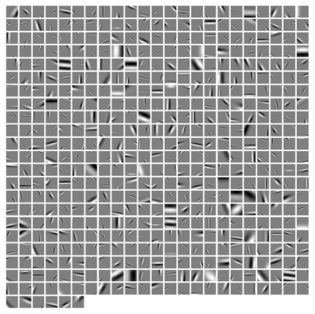

gabor-fitting
=============
An approach for fitting Gabor functions to learned image dictionaries. 

## Example performance
On the left, a dictionary to be fit. On the right, the fit with Gabor functions.

 

Grey represents 0 and each element is individually rescaled to increase contrast
for inspecting the fits. Rescaling is such that the largest absolute value is 
pure white or pure black, depending on the sign. For dictionary elements all
on the same scale, with elements enforced to have unit L2 norm, see 
``misc/dictionary_to_fit.png`` and ``misc/fit.png``

## Dependencies
* NumPy
* SciPy (signal and optimize modules)

### Author
Spencer Kent
